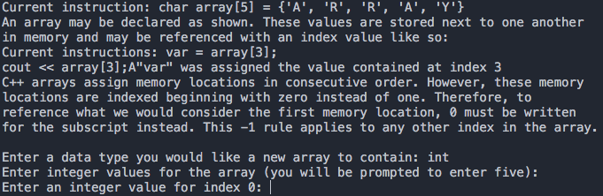

# Overview
(A note to the reader: This demonstration is not as intuitive as you might think. If you wish for a demonstration of a particular function, data type or method for C++, you would be far better off simply searching it on another more expansive and helpful resource such as C++ reference. http://en.cppreference.com/w/)

This simple C++ program brings the user through a quick demonstration of C++ arrays.

The program will show and explain to the user how memory locations and values are stored in a string in memory. The user is brought through a series of examples, demonstrations and interactions. The user will be prompted to enter a wanted data type, and then five consecutive values which will then be stored inside of an array. The user will also be shown how loops can be used to check through an array.
# Sample code
cout << "You now have a " << dataType << "array with all indexes declared. With a for loop, you can sift through all of the values using the control variable of the loop." <<endl;
	cout << "Current instruction: for (i = 0; i < 5; i++) {cout << array[i] << endl;}";
	for (int i = 0; i < 5; i++) {
		cout << array[i] << endl;
	}
cout << "Now you may take these examples and implement them according to your needs.";
# Screenshot

# Collaborators
Damien Strand (60005165@ironschools.org) Raymond Fisher (raymond.fisher256@gmail.com).
